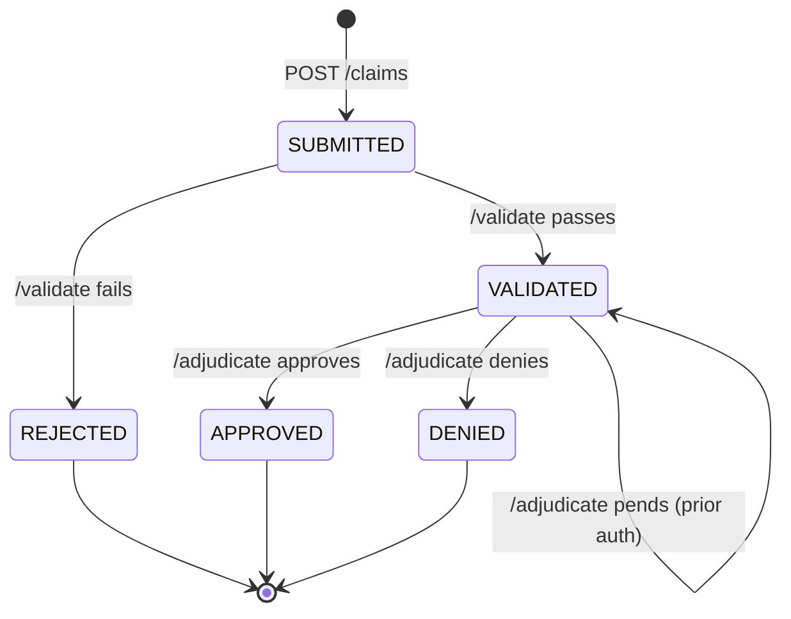
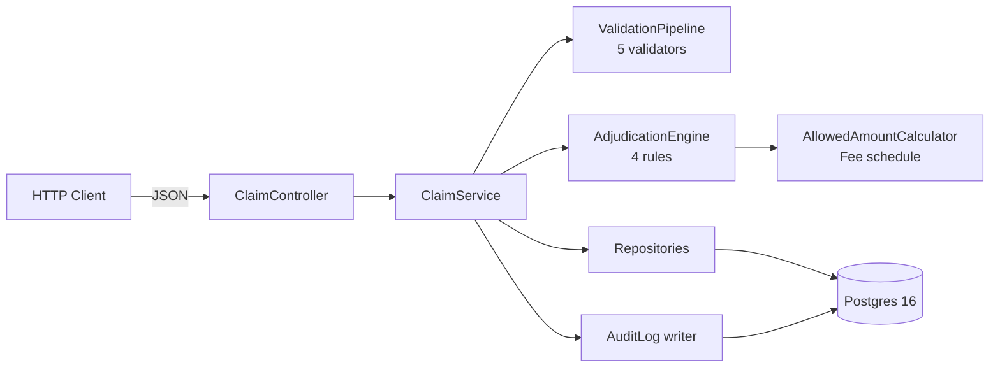
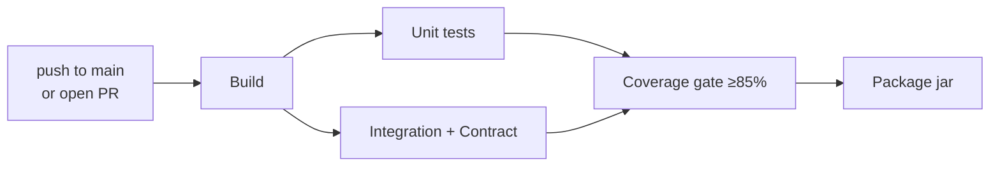

# AdjudiCore

Healthcare claims validation and adjudication API — portfolio piece
demonstrating enterprise-grade QA engineering for payer systems.

[](https://github.com/AhmedKamal-41/adjudicore/actions/workflows/ci.yml)


AdjudiCore simulates the intake, validation, and adjudication workflow of
a commercial insurance payer using synthetic patient data. It models the
two-phase state machine real payers use: SUBMITTED → VALIDATED →
(APPROVED | DENIED | PENDED | REJECTED), with a full audit log capturing
every state transition. The project exists as a demonstration of QA
engineering practice: 228 tests across 4 layers, 98% mutation score via
PIT, measured p95 SLOs via k6, and a CI pipeline that enforces quality
gates on every commit.

## Claim Lifecycle



## Architecture



## Quick Start

### Prerequisites
- Java 17
- Docker + Docker Compose
- Maven 3.9+

### Run locally
```bash
docker compose up -d           # start Postgres 16.13
mvn flyway:migrate             # apply schema migrations
mvn spring-boot:run            # start API on :8080
```

### Try it
```bash
# Submit a claim
curl -X POST http://localhost:8080/api/v1/claims \
  -H "Content-Type: application/json" \
  -d '{
    "memberId": "M001",
    "providerNpi": "1234567890",
    "serviceDate": "'"$(date +%Y-%m-%d)"'",
    "procedureCode": "99213",
    "diagnosisCode": "J45.909",
    "billedAmount": 150.00
  }'
```

API docs: http://localhost:8080/swagger-ui.html
Raw spec: http://localhost:8080/v3/api-docs

### Load synthetic demo data
```bash
./scripts/load-synthetic-data.sh
```
Loads 50 synthetic claims covering every adjudication outcome
(approve, deny, pend, reject). Requires `jq` (`brew install jq` or
`apt install jq`).

### Try the Postman collection
Import `docs/postman/AdjudiCore.postman_collection.json` into Postman.
Set the `baseUrl` collection variable to your local API URL.
Run the "05 — Full Lifecycle" request to execute the entire flow.

## Testing Strategy

Four distinct test layers, each targeting a different quality axis:

| Layer | Count | Tool | Runtime | Purpose |
|---|---|---|---|---|
| Unit | 157 | JUnit 5, Mockito | ~2s | Pure logic and branch coverage |
| Integration | 35 | Testcontainers + REST Assured | ~45s | Full-stack end-to-end behavior |
| Contract | 36 | REST Assured | ~30s | HTTP response shape and error envelopes |
| Performance | 3 scenarios | k6 | ~2m | p95 < 500ms SLOs |
| Mutation | 132 mutants | PIT (STRONGER) | ~8m | Test-quality verification |

**Totals:** 228 test methods · 98.97% line coverage · 95.65% branch coverage · **98% mutation score**

See the [MUTATION_REPORT](docs/MUTATION_REPORT.md) for per-mutant analysis and the [performance README](perf/README.md) for SLO rationale.

### Why mutation testing
98% line coverage means "every line executes during tests" — it does NOT
mean "every bug would be caught." Mutation testing proves tests are
meaningful by intentionally breaking production code (swapping `>` for
`>=`, replacing return values, etc.) and verifying tests fail.
AdjudiCore's 98% mutation score means 130 of 132 generated mutants are
detected by the test suite; the 2 surviving are documented equivalent
mutations.

## API Overview

| Method | Path | Description | Status transition |
|---|---|---|---|
| POST | `/api/v1/claims` | Submit a new claim | → SUBMITTED |
| GET | `/api/v1/claims/{id}` | Retrieve claim by ID | (read-only) |
| POST | `/api/v1/claims/{id}/validate` | Run validation pipeline | SUBMITTED → VALIDATED \| REJECTED |
| POST | `/api/v1/claims/{id}/adjudicate` | Run adjudication rules | VALIDATED → APPROVED \| DENIED \| (PEND) |

Full OpenAPI 3 specification auto-generated via springdoc. Interactive at [`/swagger-ui.html`](http://localhost:8080/swagger-ui.html).

## Validation Pipeline

5 validators run in order. The pipeline collects ALL failures (no
short-circuit) so claims reports surface every issue at once.

| Order | Validator | Reject codes |
|---|---|---|
| 10 | MemberEligibility | CARC-31 (unknown member), CARC-27 (out of coverage window) |
| 20 | ProviderNetwork | CARC-B7 (unknown provider), CARC-242 (OON + strict network plan) |
| 30 | ServiceDate | CARC-181 (future date), CARC-29 (>365 days stale) |
| 40 | Amount | CARC-45 (≤0 or over per-plan cap) |
| 50 | CodeFormat | CARC-181 (CPT or ICD-10 format invalid) |

## Adjudication Engine

4 rules run in order. The first DENY or PEND short-circuits the pipeline
(matches real payer engine behavior). The terminal rule always APPROVES
if no prior rule has decided.

| Order | Rule | Outcome | CARC |
|---|---|---|---|
| 10 | DuplicateClaim | DENY (or pass) | CARC-18 |
| 20 | PriorAuth | PEND (or pass) | CARC-197 |
| 30 | CoverageLimit | DENY (or pass) | CARC-119 |
| 40 | AllowedAmount | APPROVE (terminal) | — |

## Performance (measured via k6)

| Scenario | VUs | Duration | p95 observed | SLO | Passed |
|---|---|---|---|---|---|
| Submit-only | 50 | 30s | 58ms | < 500ms | ✅ |
| Full lifecycle | 20 | 30s | 452ms | < 500ms | ✅ |
| Duplicate stress | 30 | 20s | 742ms | < 900ms | ✅ |

Full-lifecycle SLO covers submit → validate → adjudicate as one atomic
user flow. Duplicate-stress has a larger budget because the
memberHistory scan grows with claims-per-member during the test; see
[perf/README.md](perf/README.md) for rationale.

## Tech Stack

| Layer | Tech |
|---|---|
| Runtime | Java 17, Spring Boot 3.3.5 |
| Persistence | PostgreSQL 16.13, Flyway, Spring Data JPA |
| Validation | Jakarta Bean Validation (Hibernate Validator) |
| Testing | JUnit 5, Mockito, Testcontainers, REST Assured, PIT, k6 |
| Observability | Spring Boot Actuator, Hibernate Statistics |
| Docs | springdoc-openapi (Swagger UI), Mermaid |
| CI/CD | GitHub Actions, JaCoCo, Maven |

## CI Pipeline



Four separate workflows:
- `ci.yml` — runs on every push and PR, gates coverage at 85%
- `mutation.yml` — weekly (Monday 06:00 UTC) + manual; uploads PIT report
- `perf.yml` — on main push + manual; runs k6 against fresh Postgres
- `pr-quality.yml` — on PRs; enforces conventional commit titles and warns on large diffs

## Repository Layout

```
adjudicore/
├── src/
│   ├── main/java/com/ahmedali/claimguard/
│   │   ├── api/              controllers + DTOs
│   │   ├── domain/           JPA entities
│   │   ├── repository/       Spring Data JPA
│   │   ├── service/          business orchestration
│   │   ├── validation/       5 validators + pipeline
│   │   ├── adjudication/     4 rules + engine + calculator
│   │   ├── exception/        custom exceptions + global handler
│   │   └── config/           Spring + OpenAPI config
│   ├── main/resources/
│   │   ├── db/migration/     Flyway V1-V6
│   │   └── application*.yml
│   └── test/java/
│       ├── (unit tests colocated with subjects)
│       ├── integration/      Testcontainers-backed
│       └── contract/         REST Assured HTTP contracts
├── perf/                     k6 scenarios + SLO docs
├── docs/                     Architecture + mutation report
├── scripts/                  Synthetic data loader
├── .github/workflows/        CI + mutation + perf + PR quality
└── pom.xml
```

## Key Design Decisions

- **Two-phase state machine.** Validation and adjudication are separate
  endpoints because real payer systems model them as distinct pre-flight
  and execution phases. A claim that fails validation never reaches
  adjudication.
- **Validation collects; adjudication short-circuits.** Validation emits
  every failure so the provider can fix all issues at once. Adjudication
  stops at the first DENY/PEND because once denied, further rules are
  meaningless.
- **PEND keeps status as VALIDATED.** Prior-auth pending is recorded as
  an audit-only transition, not a status change. This allows
  re-adjudication after the auth code arrives without a state unwind.
- **Audit log decoupled from claims.** No foreign key from
  `claim_audit_log.claim_id → claims.claim_id`. Audit trails must
  survive claim archival or anonymization, which is a real concern for
  healthcare data.
- **BigDecimal with explicit scale.** All money math uses `BigDecimal`
  with scale 2 and `RoundingMode.HALF_UP`. Floating-point representation
  errors would compound across thousands of claims.

Full rationale in [docs/ARCHITECTURE.md](docs/ARCHITECTURE.md).

## Roadmap / Known Limitations

- **Authentication.** Audit rows are hardcoded as `SYSTEM`. Once auth
  lands, the authenticated principal replaces it.
- **Member history query is unbounded.** `findAllByMemberId` loads all
  prior claims. Bounded in test data; degrades linearly in production.
  Next iteration would add date-windowed repository methods plus an
  index on `(member_id, service_date)` — measured via k6 scenario 3
  which shows p95 ballooning when the table isn't truncated between
  runs.
- **Prior-auth workflow is write-only.** PEND records the audit; a full
  implementation would expose an endpoint for auth-code submission and
  re-adjudication.

## License

MIT. See [LICENSE](LICENSE).
